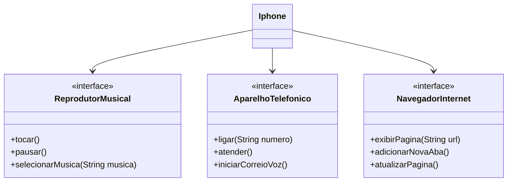

# Desafio da [DIO](www.dio.me) - Trilha Java Básico POO
## Desafio de Projeto
O desafio é diagramar e modelar um Iphone em `UML` e `código` baseado-se no vídeo do lançamento do primeiro Iphone, onde Steve Jobs anuncia que o Iphone é a junção de um reprodutor musical, um aparelho telefônico e um dispositivo de comunicação com a internet (navegador).

Utilize conceitos de POO para fazer um diagrama com a ferramenta de sua preferência e criar as interfaces que representam as seguintes funções:
1. **Reprodutor Musical**
   - Métodos: `tocar()`, `pausar()`, `selecionarMusica(String musica)`
2. **Aparelho Telefônico**
   - Métodos: `ligar(String numero)`, `atender()`, `iniciarCorreioVoz()`
3. **Navegador na Internet**
   - Métodos: `exibirPagina(String url)`, `adicionarNovaAba()`, `atualizarPagina()`

### Objetivo
1. Criar um diagrama UML que represente as funcionalidades descritas acima.
2. Implementar as classes e interfaces correspondentes em Java (Opcional).

## Diagrama UML

O diagrama UML foi criado utilizando a sintaxe Mermaid, uma alternativa open-source e que é compatível com arquivos Markdown.

## 🔗 Referências
- Videoaulas do Bootcamp na plataforma da DIO
